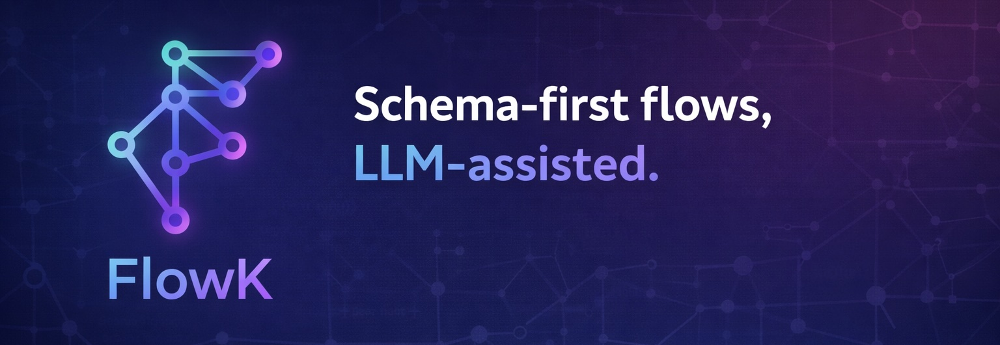
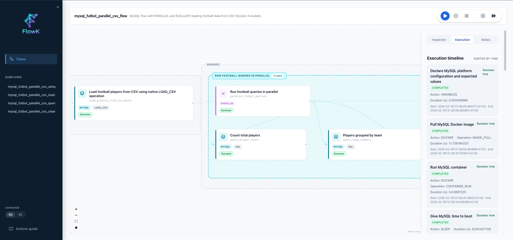

<div align="center">
  

  <p><strong>The Modular Automation Engine for DevOps, CI/CD & Quality Engineering</strong></p>

  <a href="./docs/getting-started.md">Getting Started</a> •
  <a href="./docs/core-concepts.md">Core Concepts</a> •
  <a href="./docs/actions/README.md">Actions Reference</a> •
  <a href="./docs/ui-guide.md">UI Guide</a>
</div>

---

## Overview

**FlowK** is a powerful automation engine designed to simplify complex workflows without writing a single line of imperative code. **The philosophy is simple: usage of 100% JSON-defined flows.**

While you can write these flows by hand, FlowK is architected to be **LLM-Native**. The ultimate goal is for an AI to generate the entire flow for you. By exposing a comprehensive, self-generated context guide, FlowK empowers Large Language Models to act as your autonomous DevOps & QA engineers, creating complex, deterministic automations from high-level instructions.

Whether you are running local dev setups, CI/CD pipelines, or **complex end-to-end integration tests**, FlowK provides a reliable runtime for your AI-generated tasks.

### Key Features

- **No-Code / JSON-Only**: Define 100% of your infrastructure and logic in schema-validated JSON. No scripts required.
- **Composable Architecture**: Nest flows within flows (`subflows`) to encourage reuse and modularity.
- **Parallel Execution**: Native support for parallel tasks to speed up independent operations.
- **Rich Action Ecosystem**: Built-in support for HTTP requests, Docker, Kubernetes, Database (MySQL, Postgres), SSH, and more.
- **Interactive UI**: An optional web interface to visualize flow execution, inspect task details, and view real-time logs.
- **Resilient**: Features like `on_error_flow` and `finally_flow` ensure robust error handling and resource cleanup.
- **AI-Ready**: Designed for LLM-assisted workflows. Download the full action schema and context to let AI generate flows for you.

### Why FlowK

- **Single binary runtime** that runs locally or in CI without external orchestration services.
- **Schema-validated JSON flows** for deterministic, reproducible automation.
- **Built-in integrations** for infrastructure, testing, and operational workflows.
- **Developer-friendly UI** for fast debugging and execution visibility.
- **Self-sufficient**: the application runs without requiring external apps or services.

## Quick Start

### 1. Download (Recommended)

Get the latest prebuilt binaries from [GitHub Releases](https://github.com/jmmsegovia/flowk/releases).

Download the archive for your OS/architecture and run the `flowk` binary inside.

### 2. Run a Flow
```bash
# Execute a flow and see logs in your terminal
./flowk run -flow ./flows/print/loop_without_for.json
```

There are 50+ example flows under `flows/`. Some examples require external services; to run them all, you’ll need additional dependencies such as Docker Desktop with Kubernetes enabled.

### 3. Launch the UI
```bash
# Start the UI server to visualize execution
./flowk run -serve-ui

# Then import and run the flow from
./flows/print/loop_without_for.json
```
_Open your browser at `http://localhost:8080` (default port)_

<div align="center">
  
</div>

### Build (Optional)

If you prefer to compile locally:

```bash
go build -o ./bin/flowk ./cmd/flowk/main.go
```

Requires Go 1.24.3 or newer.

## Download Releases

Get the latest prebuilt binaries from [GitHub Releases](https://github.com/jmmsegovia/flowk/releases).

Download the archive for your OS/architecture and run the `flowk` binary inside.

## Documentation

- **[Getting Started](./docs/getting-started.md)**: Installation, configuration, and first steps.
- **[Core Concepts](./docs/core-concepts.md)**: Deep dive into how FlowK works (Flows, Tasks, Variables, Control Flow).
- **[Actions Reference](./docs/actions/README.md)**: Comprehensive guide to all available actions (HTTP_REQUEST, DB_*, SHELL, etc.).
- **[UI Guide](./docs/ui-guide.md)**: How to use the web interface for monitoring and debugging.
- **[Developer Guide](./docs/developer-guide.md)**: Architecture overview and contributing guidelines.

## Contributing

We welcome contributions! Please see our [Contributing Guide](CONTRIBUTING.md) and [Code of Conduct](CODE_OF_CONDUCT.md) for details.

## License

FlowK is open-source software. See the [LICENSE](LICENSE) file for more information.
