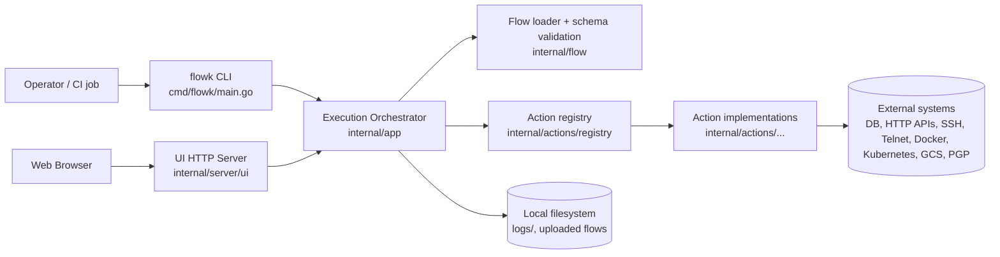
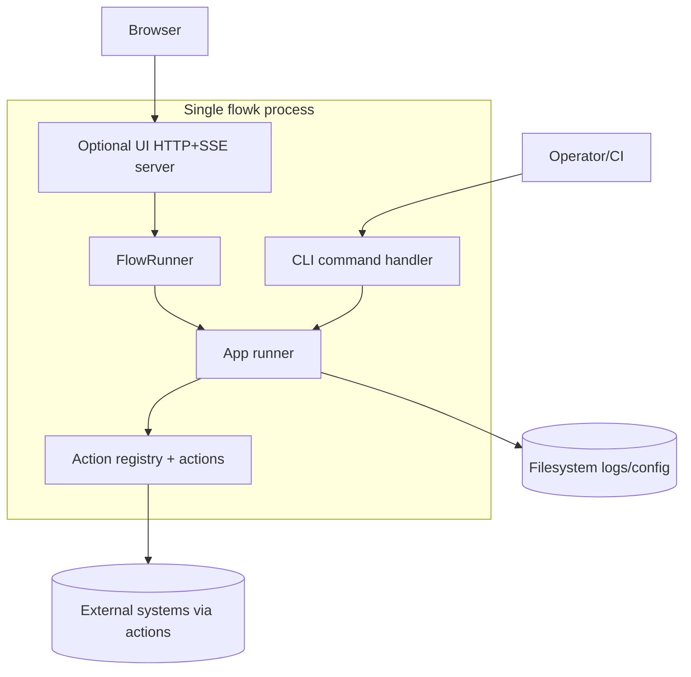
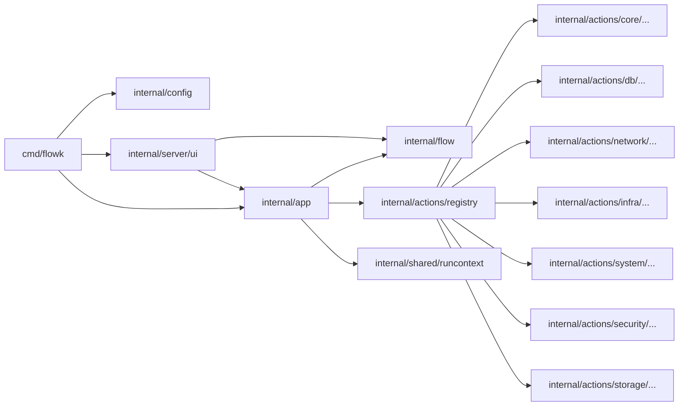
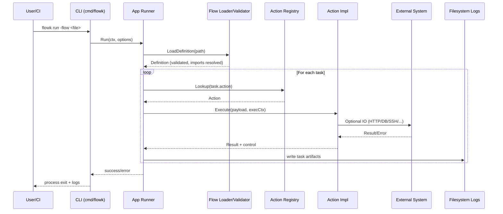

# Architecture Overview

## 1. Purpose and Scope

FlowK is a Go command-line application that executes JSON-defined automation flows. A flow is composed of ordered tasks (`action` + payload), with support for nested flows, loops, parallel execution, and optional web UI control/monitoring. The main user-facing entrypoint is the `flowk` binary (`run`, `info`, `version`, `help`).

This document covers:
- Runtime architecture of the CLI and optional UI server.
- Core execution engine, action registry, and package boundaries.
- Data/control flow, concurrency model, configuration, error handling, and security-relevant behavior.

This document does **not** cover:
- Deployment topology beyond what is explicit in code.
- Product/process policies not implemented in the repository.

## 2. High-Level Architecture

At a high level, FlowK is a modular monolith:
- `cmd/flowk` parses CLI arguments and starts either direct execution mode or UI-server mode.
- `internal/app` orchestrates flow loading, execution lifecycle, task state, artifacts, and events.
- `internal/flow` validates and loads JSON flow definitions (including imports and schema validation).
- `internal/actions/*` provides pluggable action implementations discovered via registration.
- `internal/server/ui` exposes HTTP endpoints + SSE stream for UI-driven runs.

## 3. Architectural Style and Principles

### Style
- **Modular monolith**: one deployable binary with internal package boundaries.
- **Action-plugin pattern (compile-time registration)**: actions self-register in a global registry (`init()` + `registry.Register`), then are looked up by task `action` name at runtime.
- **Workflow engine**: a deterministic task runner with control directives (`jump`, `exit`, `break`) and optional cleanup/finally flow hooks.

### Why this structure (as seen in code)
- The binary imports action packages for side-effect registration, then dispatches dynamically through `registry.Lookup`.
- Flow schema is assembled from base schema + action-provided schema fragments, making action extensibility first-class.
- UI is optional and wraps the same app engine; no separate backend service.

### Go-specific principles in use
- **Composition over inheritance** through package-level components (`app`, `flow`, `registry`, `ui`).
- **Interfaces for behavior boundaries** (`registry.Action`, `app.FlowObserver`, logger contracts).
- **Explicit dependency passing** via `context.Context`, execution context structs, and constructor/config structs.

## 4. Containers / Runtime Components (C4 – Container Level)

Runtime components in this repository:
1. **CLI Runtime (`flowk run`)**
   - Loads config, validates/loads flow, executes tasks, writes artifacts.
2. **UI Server Mode (`flowk run -serve-ui`)**
   - Hosts REST endpoints and SSE stream.
   - Coordinates runs through `FlowRunner` (single-run at a time).
3. **In-process Action Executors**
   - Invoked by the app engine; they call external systems depending on task type.

There are no standalone background daemons/schedulers in this repository; asynchronous behavior is in-process goroutines.

## 5. Internal Components and Packages (C4 – Component Level)

### Main packages
- `cmd/flowk`: CLI parsing, command dispatch, startup wiring.
- `internal/config`: XDG-based config path resolution, load/default/validate for `config.yaml`.
- `internal/flow`: flow definition model, import resolution, JSON schema validation, flow/task validation.
- `internal/app`: orchestration engine (task execution loop, resume/stop behavior, logging artifacts, event publishing).
- `internal/actions/registry`: action contracts and registration/lookup, schema fragment aggregation.
- `internal/actions/*`: concrete action implementations (core, db, network, infra, security, storage, system).
- `internal/server/ui`: HTTP API, static file serving, SSE event hub, flow run coordination.
- `internal/shared/runcontext`: context helpers for stop requests, stop-at-task, and resume flags.

Boundary summary:
- **CLI/UI layers** trigger execution but do not implement business task logic.
- **App layer** owns orchestration and lifecycle.
- **Flow layer** owns definition loading/validation.
- **Action layer** owns integration-specific behavior.

## 6. Data Flow

### Request lifecycle (CLI execution)
1. User invokes `flowk run` with flags.
2. CLI loads config and determines mode.
3. App loads flow definition (`internal/flow`): JSON schema validation + import expansion + semantic validation.
4. Engine iterates tasks, expands variables/payloads, resolves action implementation from registry.
5. Action executes; result/metadata are persisted into task state.
6. Engine writes per-task artifacts (`task_log.json`, `environment_variables.json`) under `logs/`.
7. Engine publishes flow/task events; in UI mode these events are streamed via SSE.

## 7. Concurrency and Execution Model

- **Primary execution is sequential** at top-level task loop.
- **Parallel task execution** is explicit through `PARALLEL` action:
  - Subtasks run in goroutines.
  - `sync.WaitGroup` coordinates completion.
  - Mutex-protected maps collect results/errors/variables.
  - Optional fail-fast mode uses cancellable context.
- **UI event streaming**:
  - EventHub supports multiple subscribers with buffered channels.
  - SSE endpoint streams historical + live events.
- **Run coordination**:
  - `FlowRunner` enforces single active run using mutex + `running` flag.
  - Stop/stop-at-task handled through context-bound atomic/mutex-backed trackers.

## 8. Configuration and Environment

Configuration is file-based with optional CLI override:
- Default config path: `$XDG_CONFIG_HOME/flowk/config.yaml`.
- `-config` flag can point to an alternate config file.
- If config file is missing, defaults are generated automatically.

Current built-in config domain:
- `ui.host`, `ui.port`, `ui.dir`.

Environment separation:
- No first-class `dev/staging/prod` profiles in code.
- Separation is achieved externally by supplying different flow files and/or config file paths per environment.

## 9. Error Handling and Observability

### Error handling
- Errors are returned up the call chain with contextual wrapping (`fmt.Errorf(...: %w)`).
- CLI converts usage errors into help output and exits non-zero; runtime errors are logged and terminate process.
- Task-level failures are persisted to artifacts and emitted as flow events.

### Logging and runtime artifacts
- Uses standard Go logger (`log.Default`) and task-scoped logging wrapper.
- Per-task logs/state snapshots are written to filesystem (`logs/<flow>/...`).
- UI mode exposes real-time events via SSE (`/api/run/events`).

### Metrics/tracing
- No built-in metrics or distributed tracing instrumentation is present.

## 10. Security Considerations

Implemented and visible security-relevant behaviors:
- **Input validation**: flow JSON is validated against schema before execution.
- **Flow import path hardening (UI upload path)**: imports that would escape the upload root are remapped to safe copies under the upload root when the source is inside the working directory or configured flow root; otherwise the upload is rejected.
- **Secret masking in artifacts**: variables marked `Secret` are persisted as `<secret>` in snapshots.
- **Config file permissions**: default config is written with restrictive mode (`0600`) and config directory with `0700`.

Not present as core platform features:
- No built-in authn/authz on UI endpoints.
- No internal secret manager; repository guidance recommends env vars/secret managers operationally.

## 11. Architecture Decision Records (ADR)

No formal ADR directory/files are present in this repository.

Implicit architectural decisions inferred from code:
1. Keep a **single-binary architecture** (CLI + optional UI mode in one executable).
2. Use **JSON-defined workflows** validated by schema.
3. Use **registry-based action extensibility** with compile-time imports.
4. Keep **execution state and artifacts local** (filesystem), not in a central database.
5. Keep **UI tightly coupled to engine events** through in-process observer + SSE.

## 12. Limitations and Future Improvements

Current limitations (based on repository implementation):
- Global action registry and side-effect imports require rebuild for new action plugins.
- UI server endpoints appear unauthenticated by default.
- Observability is log/event based; no native metrics/tracing pipeline.
- Flow state is process-local; no distributed run coordination or persistence backend.

Reasonable evolution paths:
- Introduce optional auth middleware for UI endpoints.
- Add metrics/tracing exporters (OpenTelemetry) around task lifecycle.
- Abstract run-state persistence behind an interface for resumability across process restarts.
- Consider dynamic plugin loading model if runtime action extensibility is required.
