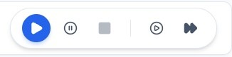
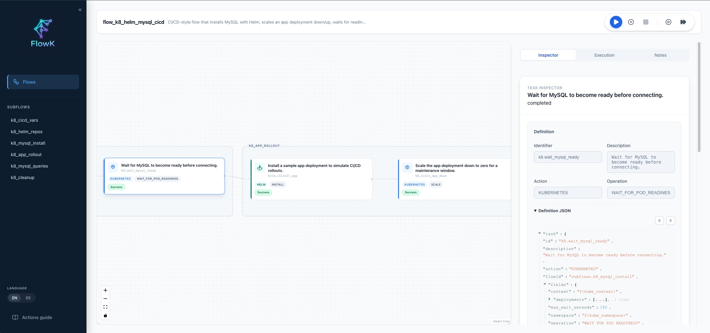

# UI Guide

FlowK includes an optional web interface that provides a rich visual experience for monitoring and debugging your automation flows.

## Accessing the UI

To start the UI, include the `-serve-ui` flag when running a flow:

```bash
./bin/flowk run -serve-ui -flow ./path/to/flow.json
```

By default, the UI is accessible at `http://localhost:8080`.

## Features

### 1. Execution Controls
The header controls let you start, stop, and resume runs. Some buttons act on the entire flow and others act on the selected task in the canvas.



- **Run flow (Play)**: starts a full flow run. Disabled while a run is in progress.
- **Stop at task (Pause)**: toggles the selected task as a stop point; the run stops right after that task completes. Applies only to top-level tasks (not subtasks).
- **Stop flow (Stop)**: requests the current run to stop; the flow finishes after the current task completes.
- **Run task (PlayCircle)**: runs only the selected task (or a subtask if you select one inside a block).
- **Resume from task (FastForward)**: resumes the flow starting at the selected task after a prior run has finished; available only when the task has completed (success or failure) and is not a subtask.

### 2. Flow Visualization
The main view renders your flow as an interactive graph.
- **Nodes**: Represent tasks.
- **Edges**: Show the dependency and execution order.
- **Subflows**: Nested flows are encapsulated in expandable groups.
- **Status Indicators**: Tasks change color real-time based on status (Pending: Grey, Running: Blue, Success: Green, Error: Red).



### 3. Task Inspector
Clicking on any task node opens the **Inspector Panel** on the right.
- **Definition**: View the raw JSON configuration of the task.
- **Input/Output**: See exactly what inputs the task received and what output it produced.
- **Logs**: View task-specific logs.

### 4. Real-Time Execution Log
The bottom panel acts as a unified terminal, streaming logs from all tasks as they execute. You can filter these logs by log level or search for specific keywords.


### 5. Variables Explorer
View the current state of all variables in the flow context. This is crucial for debugging data passing issues between tasks.

## Tips & Tricks
- **Zoom/Pan**: Use your mouse wheel or trackpad to zoom in/out of large flows.
- **Auto-Focus**: The UI will automatically center on the currently running task if you enable "Follow Execution".
